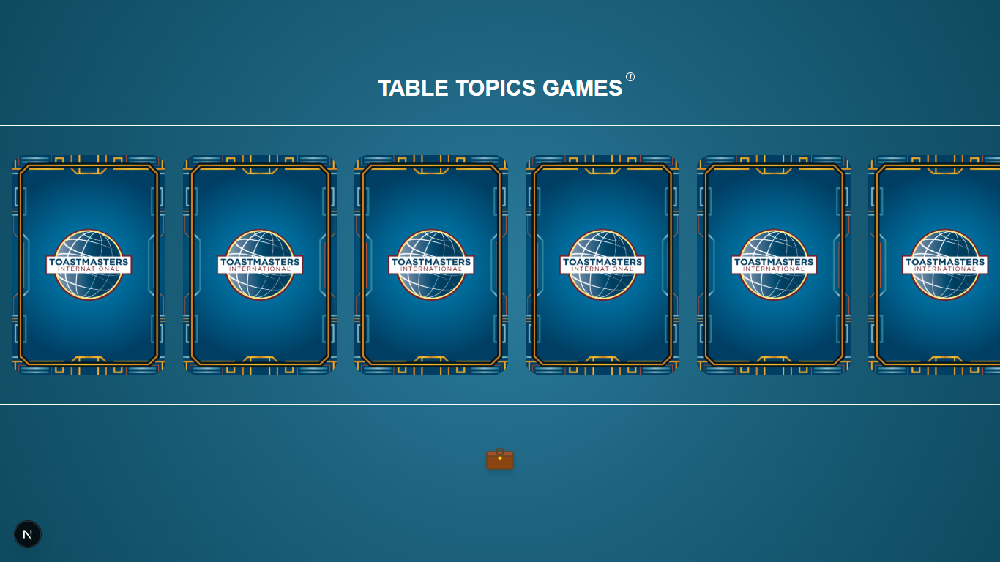
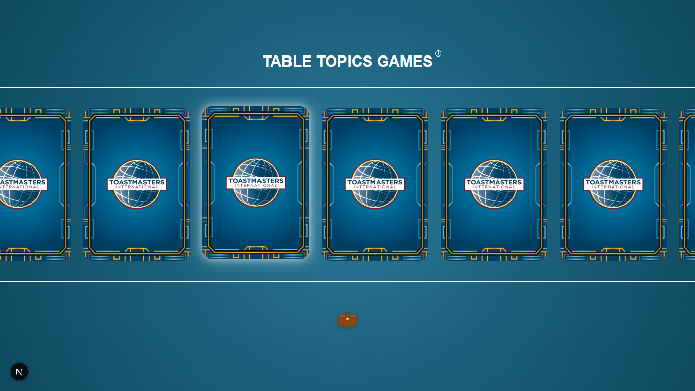
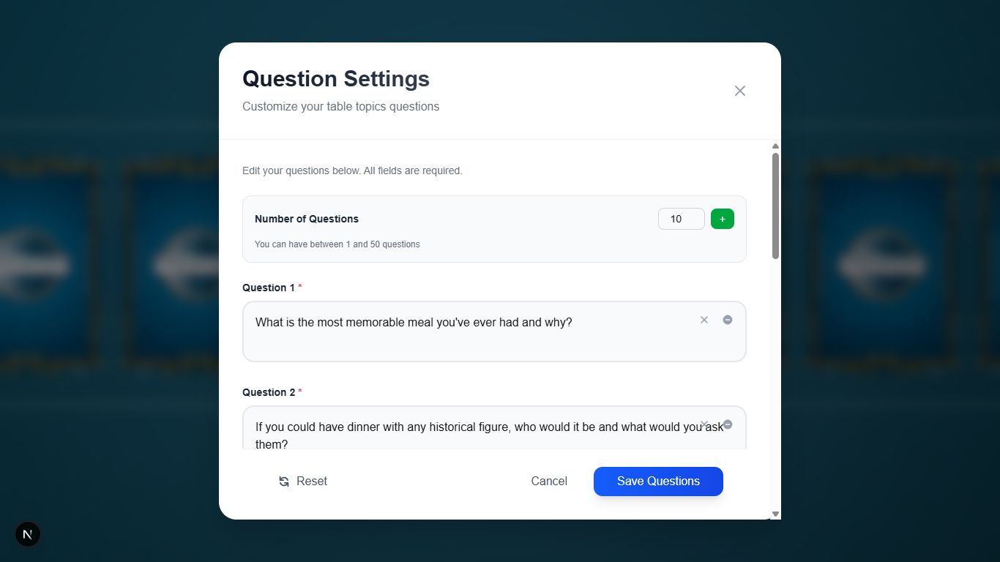
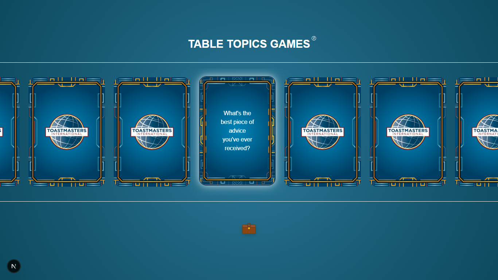

# Table Topics Wheel

An interactive digital companion for Toastmasters Table Topics sessions. Features flippable cards with thought-provoking questions designed to help members practice impromptu speaking skills and build confidence in public speaking.

## Screenshots

### Homepage


### Card Hover Effect


### Question Settings Modal


### Flipped Card with Question


## How to Play

1. **Browse the Cards**: Scroll horizontally through the collection of conversation starter cards
2. **Flip a Card**: Click on any card to reveal the question on the back
3. **Answer & Discuss**: Take turns answering the questions or use them as group discussion starters
4. **Customize Questions**: Click the briefcase icon to open the question editor where you can:
   - Add your own custom questions
   - Edit existing questions
   - Reset to default questions
   - Save up to 50 questions

## Features

- 21 thoughtful default conversation starters
- Smooth card flip animations
- Custom question management
- Questions automatically save to your browser
- Responsive design for all devices

## Getting Started (Development)

First, run the development server:

```bash
npm run dev
# or
yarn dev
# or
pnpm dev
# or
bun dev
```

Open [http://localhost:3000](http://localhost:3000) with your browser to see the result.

## Learn More

To learn more about Next.js, take a look at the following resources:

- [Next.js Documentation](https://nextjs.org/docs) - learn about Next.js features and API.
- [Learn Next.js](https://nextjs.org/learn-pages-router) - an interactive Next.js tutorial.

You can check out [the Next.js GitHub repository](https://github.com/vercel/next.js) - your feedback and contributions are welcome!

## Deploy on Vercel

The easiest way to deploy your Next.js app is to use the [Vercel Platform](https://vercel.com/new?utm_medium=default-template&filter=next.js&utm_source=create-next-app&utm_campaign=create-next-app-readme) from the creators of Next.js.

Check out our [Next.js deployment documentation](https://nextjs.org/docs/pages/building-your-application/deploying) for more details.
